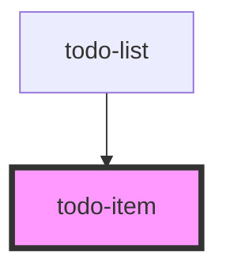

# todo-item

<!-- Auto Generated Below -->

## Properties

| Property       | Attribute | Description | Type                       | Default     |
| -------------- | --------- | ----------- | -------------------------- | ----------- |
| `deleteAction` | --        |             | `(task: Task) => void`     | `undefined` |
| `task`         | --        |             | `Task`                     | `undefined` |
| `toggleAction` | --        |             | `(taskId: string) => void` | `undefined` |

## Dependencies

### Used by

 - [todo-list](../todo-list-component)

### Graph

----------------------------------------------

*Built with [StencilJS](https://stenciljs.com/)*
